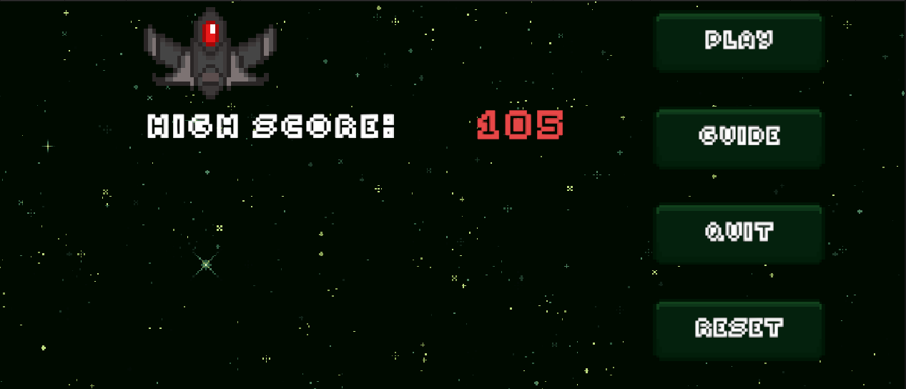
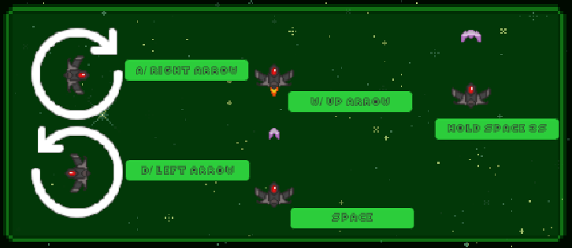
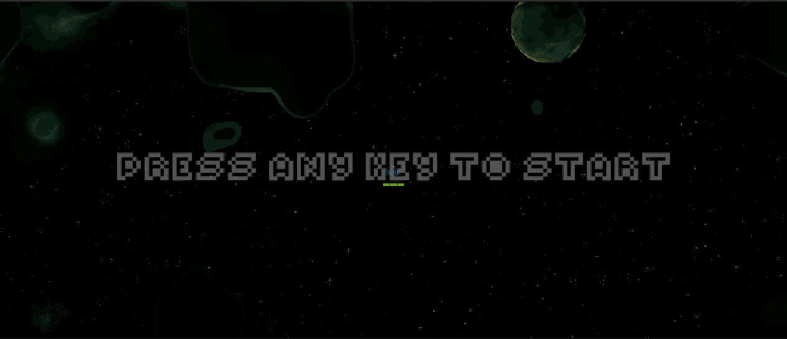
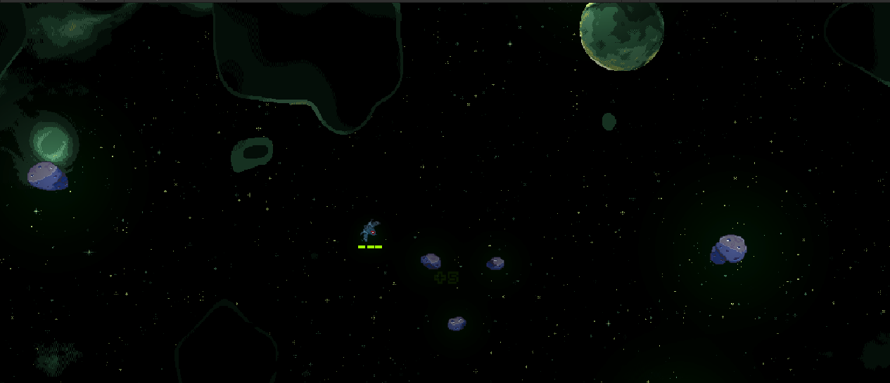
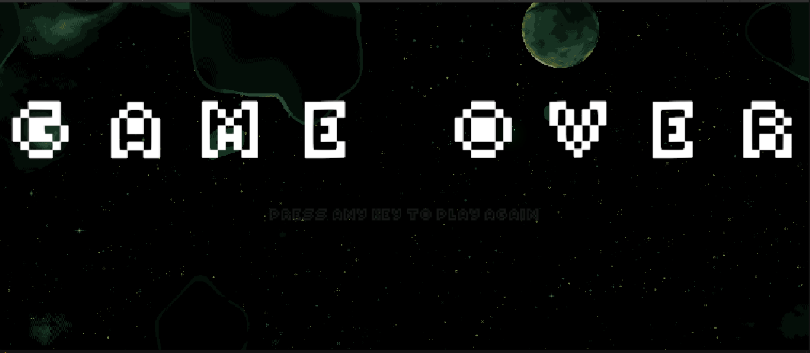

# **Game Design Document: Space Shooter** {#game-design-document-space-shooter .unnumbered}

## **Mô tả** 

### - Tên game: Space Shooter {#tên-game-space-shooter .unnumbered}

### - Nền tảng: PC, Mobile {#nền-tảng-pc-mobile .unnumbered}

### - Bối cảnh: người chơi điều khiển tàu bay di chuyển trong vũ trụ, né tránh và tiêu diệt thiên thạch. {#bối-cảnh-người-chơi-điều-khiển-tàu-bay-di-chuyển-trong-vũ-trụ-né-tránh-va-tiêu-diệt-thiên-thach. .unnumbered}

## **Quy tắc chơi**

### **Điều khiển phi thuyền:**

> \- Di chuyển **trái/phải/lên/xuống** bằng phím **A/D/W/S.**
>
> \- Bắn đòn tấn công bình thường bằng phím **Space** và đòn tấn công
> tích tụ (mạnh hơn) nhấn **giữ Space**.

### **Va chạm thiên thạch:**

> Mỗi lần va chạm thiên thạch sẽ mất lượng máu tương ứng với số lượng va
> chạm (vd: 1 thiên thạch = 1 máu).

### **Bắn thiên thạch:**

> \- Khi thiên thạch lớn bị bắn trúng đủ 3 lần đòn tấn công thường nó sẽ
> bị phát nổ và phân tách ra các thiên thạch nhỏ hơn (vd: 1 thiên thạch
> lớn phân tách =\> 2 hoặc 3 thiên thạch nhỏ).
>
> \- Khi thiên thạch lớn bị bắn trúng bởi đòn tấn công tích tụ thì thiên
> thạch sẽ bị phá hủy không phân tách.

### **Thu thập điểm:**

> Nhận điểm bằng cách tiêu diệt thiên thạch

## **Mô tả Scene**

### **Scene 1: Menu**  {#scene-1-menu .unnumbered}

Nút bấm: **Play** (vào trò chơi)**, Guide** (luật chơi)**, Quit** (thoát
trò chơi)**, và Reset** (cài lại điểm)

> Thông tin: Best Score của người chơi
>
> Hình nền: Hình nền vũ trụ có các ngôi sao và nhạc nền
>
> {width="6.267716535433071in"
> height="2.6944444444444446in"}

### **Popup: Tutorial** {#popup-tutorial .unnumbered}

> Thông tin: Hiện thị rõ cách chơi và điều khiển
>
> {width="6.267716535433071in"
> height="2.7222222222222223in"}

## **Scene 2: Game screen**  {#scene-2-game-screen .unnumbered}

\- Thông tin: số điểm ban đầu bằng 0, đầy thanh máu.\
- Kẻ dịch chỉ bao gồm:

-   Thiên thạch to

-   Thiên thạch nhỏ

\- Cách chơi: di chuyển tránh né thiên thạch để sống sót, có thể tiêu
diệt thiên thạch để nhận điểm.

{width="6.267716535433071in"
height="2.7083333333333335in"}{width="6.267175196850394in"
height="2.7067530621172353in"}

## **Scene 3: GameOver** {#scene-3-gameover .unnumbered}

Thông tin: màn hình hiển thị game over\
Nút bấm: **PRESS ANY KEY TO PLAY AGAIN**

{width="6.267716535433071in"
height="2.736111111111111in"}
